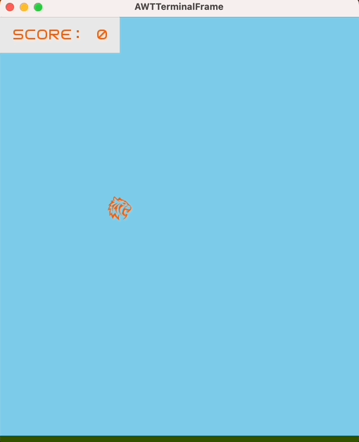

# Design Patterns, Refactoring and Testing 

>**Project**
><br />
>Course Unit: [Laboratório de Desenho e Teste de Software](https://sigarra.up.pt/feup/pt/ucurr_geral.ficha_uc_view?pv_ocorrencia_id=501676 "Software Design and Testing Laboratory"), 2nd year 
><br />
>Course: **Informatics and Computer Engineering** 
><br />
> Faculty: **FEUP** (Faculty of Engineering of the University of Porto)
><br/>
> Report: [Report.md](./docs/README.md)
><br/>
> Evaluation: **19**/20


## Project Goals

The main goal in five words:
```
Write clean and good code
```

Deploy a simply game to explore some of the existing design patterns in **Java**.
Some of the design patterns used are **Command**, **Factory** and  **Singleton**.
To check every situation where the design pattern was used, check the [Report](./docs/README.md) file.

The code were structured based on the **MVC architecture** and **SOLID** principles were followed.

To make the code even cleaner, some **refactoring techniques** were used for the refactorings made.

Another big goal of the project was to write appropriate tests for the code.
To do this, **Spock** was used.


## The game



The game is inspired by the Flappy Bird.
The objective of the game is to maneuver a small tiger through a series of walls coming from the right and pass through the gap to score a point.
The player can collect collectables, that give points or start a god mode, where the gap between the walls is increased, making the game easier.

## Code UML


### Tecnologies Used

<div>
	
	
	
	
</div>
