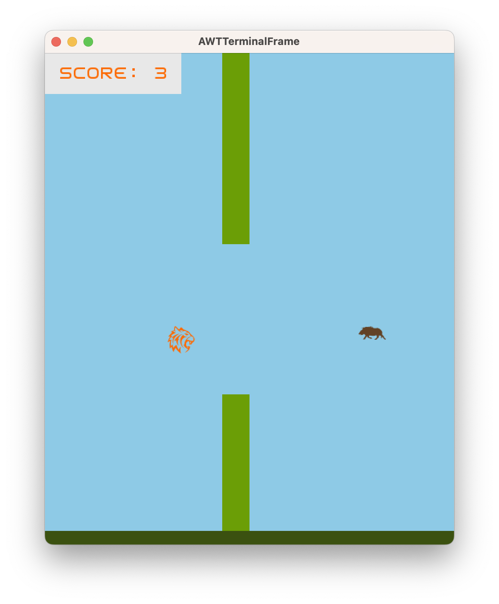

## LDTS_0402 - Flappy Tiger

This project was developed as a project for the Software Design and Testing Laboratory course, at FEUP. It is a remake of the well known flappy bird game, with a few twists.

This project was developed by *Francisco da Ana* (*up202108762*@fe.up.pt), *João Torre Pereira* (*up202108848*@fe.up.pt) and *José Pedro Evans* (*up202108848*@fe.up.pt) LDTS 2022⁄23.

### IMPLEMENTED FEATURES

- **Playable Character** - Currently the game chracter already jumps, but it is not a tiger.
- **Main Menu** - The game has a main menu, that can be accessed by pressing the escape key. The main menu has the following options:
    - **Play** - Starts a new game.
    - **Leaderboard** - Displays the top 10 scores.
    - **Instructions** - Displays the instructions of the game.
    - **Exit** - Exits the game.
- **Leaderboard** - The game keeps track of the top 10 scores, and displays them in a leaderboard.
- **Pause Screen** - The game can be paused by pressing the escape key, and the game can be resumed by pressing the space bar key.

### PLANNED FEATURES

- **Random Walls** - The walls are randomly generated, with a minimum distance between them.
- **Background music** - The game has background music, that can be turned on and off by pressing the 'm' key.
- **Sound effects** - The game has sound effects. The sound effects can be turned on and off by pressing the 's' key.
- **Collision Detection** - The game detects collisions between the player and the walls and floor, and between the player and the collectable objects. When the player collides with the walls or floor, the game ends.
- **Game Over Screen** - The game displays a game over screen when the player collides with a wall or hits the floor.
- **Collectable Objects** - The game has collectable objects, that can be collected by the player:
    - **Deer** and **Boar** - The deer can be collected by the player, and gives the player 5 points.
    - **Porto wine - God mode** - If you catch a bottle of Porto wine, the gap between the walls will be increased, making the game easier.
- **Curiosities** - There is curiosities about animals that can  be found on the main menu.

### MOCKUPS

### UML

### DESIGN 

#### Sctructure of the code

**Problem in Context**

With the increase of the complexity of the game, the code will become more difficult to understand and maintain.
So, we need to find an appropriate pattern to organize it. 

**The Pattern**

The MVC is usefull because it divides the code in three parts: the model, the view and the controller. The model is responsible for the data, the view is responsible for the visual interface and the controller for the logic of the game.
All of the three packages are independent and work together to make the game work.

**Implementation**

These packages can be found in the following folders:

- [Model](../src/main/java/feup/ldts/flappy/model/)
- [Controller](../src/main/java/feup/ldts/flappy/controller/)
- [View](../src/main/java/feup/ldts/flappy/view/)

**Consequences**

A modular sctructure of the code allowing us to divide the code in different files, can be very usefull for many reasons but it can be also a not easy task to do. This means that when we are developing the code we need to think about the structure of the code and how we are going to divide it. This is in fact a problem for people not used to work with this kind of structure. However, as the times goes on we will get used to it and benefit from it.

#### Lanterna Library Facade

**Problem in Context**

The game shouldn't depend on the specific implementation of the GUI library (Lanterna). The appllication UI framework should be easily interchangeable without affecting the rest of the code.

**The Pattern**

The Facade pattern was ideal for this problem, as it provides a unified interface to a set of diverse interfaces in a choosed library. This way, the rest of the code doesn't need to know the specifics of the library, and can be easily changed.

**Implementation**

These classes can be found in the following files:

- [GUI](../src/main/java/feup/ldts/flappy/gui/GUI.java)
- [LanternaGUI](../src/main/java/feup/ldts/flappy/gui/LanternaGUI.java)
- [Game](../src/main/java/feup/ldts/flappy/Game.java)

**Consequences**

By declaring a unified interface, the code is more readable and maintainable.
Another point is that we only need to implement the methods that we need and not the whole GUI library.
The code is also more flexible by the possibility of changing the GUI library.

------

#### Game State

**Problem in Context**

It easy to see that the whole game has several states, such as the main menu, the game itself, the game over screen, leaderboard screen, etc. So, the program should be able to handle these states in a simple and efficient way.
Also we need to easily change the game state when the user interacts with the game. For example, if the player has died, the game state should be set to the game over screen.

**The Pattern**

The State pattern allows the program to change the behavior of the application depending on the current state. For example, the main controller and viewer is defined depending on the current state and each state has its own controller and viewer.
Also the fame can easily change the state by calling the setState method.

**Implementation**

**Consequences**

The game state is defined in the Game class. This is usefull because we can change the state of the game by calling the setState method. 
The downside is that we need to have access to the Game class context in order to use the setState method.

------

#### Singleton Sound Manager

**Problem in Context**

Music and sound effects are a shared resource amond the game states and classes. Dealing with sound effects in the independet classes is not a good idea because it would be hard to manage and change the sound effects. Also, the music should be played in the background and not be interrupted by independet game elements.
So, the music and sound effects should be managed by a single class. 
This can be done by using a singleton pattern. In this pattern we only need to create a class to be responsible for playing the music and sound effects. 

**The Pattern**

Singleton pattern ensures that only one instance of the class managing the music and sound effects is created. This object is also accessible from everywhere.
In resume, there is onyl a single point to access the music and sound effects.

**Implementation**

**Consequences**

One big good consequence of using the singleton pattern is that the code would be isolated from the music and sound effects and we can be easily access them from anywhere in the code. 
Also, because there is only a single object of the class, it is imposible to have two background musics playing at the same time, for example.
Changing the music and sound effects turns out to be a easy task now.

------

### TESTING

[Pitest report](pitest/index.html)

[Jacoco report](jacoco/index.html)

### SELF-EVALUATION

- Francisco da Ana: 33.3%
- João Torre Pereira: 33.3%
- José Pedro Evans: 33.3%