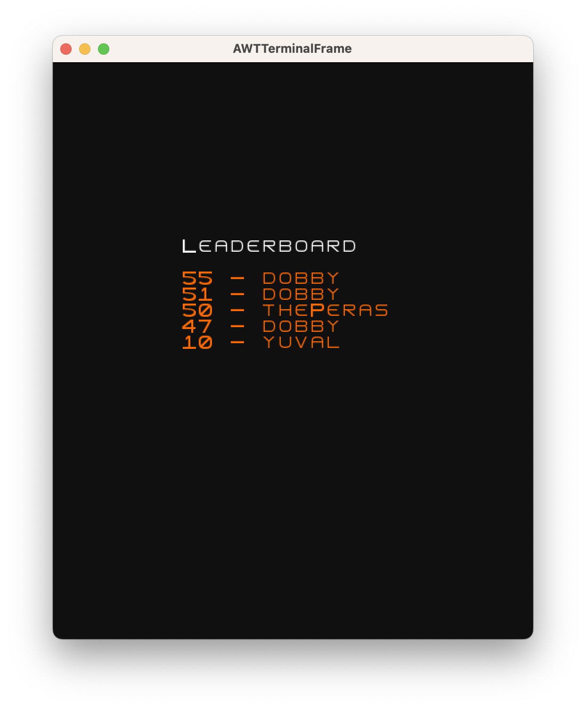
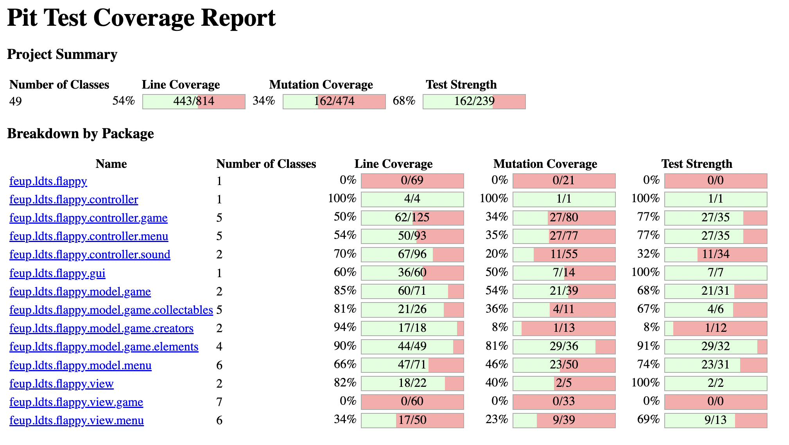

## LDTS_0402 - Flappy Tiger

The Flappy Tiger is game trully inspired by the Flappy Bird game, but with a few twists.
The objective of the game is to maneuver a small tiger, the protagonist, through a series of walls coming from the right.

Each wall has a gap and the player must pass through the gap to score a point. The game ends when the player collides with a wall or hits the floor. 
The player can also collect collectables, that give the player points or start a god mode, where the gap between the walls is increased, making the game easier.

Be aware that Flappy Tiger is an addicting game that tests the player's reflexes and patience. It's a great way to challenge yourself.

Developed by 
- **Francisco da Ana** (up202108762)
- **João Torre Pereira** (up202108848)
- **José Pedro Evans** (up202108818) 

LDTS 2022⁄23  
Software Design and Testing Laboratory

### IMPLEMENTED FEATURES

- **Playable Character** - The game has a playable character, which is a tiger, that can be controlled by the player. The
  player can control the tiger by pressing the space bar key.
- **Main Menu** - The game has a main mainMenu, that can be accessed by pressing the escape key. The main mainMenu has
  the following options:
    - **Play** - Starts a new game.
    - **Leaderboard** - Displays the top 5 scores.
    - **Instructions** - Displays the instructions of the game.
    - **Exit** - Exits the game.
- **Leaderboard** - The game keeps track of the top 5 scores, and displays them in a leaderboard, ordered by descending order of score.
- **Pause Screen** - The game can be paused by pressing the escape key, and the game can be resumed by selecting the 'Resume' option in the menu. The player can also exit the game by selecting the 'Exit' option and restart the game by selecting the 'Restart' option.
- **Random Walls** - The walls are generated with a constant distance between themselves but the height of their gap is generated randomly.
- **Background music** - The game has background music, that can be turned on and off by pressing the 'm' key. The music is different for the menus and the game.
- **Sound effects** - The game has sound effects. The sound effects can be turned on and off by pressing the 's' key.
- **Collision Detection** - The game detects collisions between the player and the walls and floor, and between the  player and the collectable objects. When the player collides with the walls or floor, the game ends.
- **Game Over Screen** - The game displays a game over screen when the player collides with a wall or hits the floor. The player can input its userName and if the score is greater than the  lowest score in the leaderboard, the score will be added to the leaderboard.
- **Collectable Objects** - The game has collectable objects, that can be collected by the player:
    - **Lamb** and **Boar** - If collected by the player, the Lamb gives the player 5 points and the Boar 3 points.
    - **Porto wine - God mode** - If you catch a bottle of Porto wine, the gap between the walls will be increased, making the game easier.
- **Curiosities** - There are curiosities about animals that can be found on the main mainMenu.

### PLANNED FEATURES

- All of the features were implemented.

### MOCKUPS

### UML

### DESIGN

#### Sctructure of the code

**Problem in Context**

With the increase of the complexity of the game, the code will become more difficult to understand and maintain.
So, we need to find an appropriate pattern to organize it.

**The Pattern**

The MVC is usefull because it divides the code in three parts: the model, the view and the controller. The model is
responsible for the data, the view is responsible for the visual interface and the controller for the logic of the game.
All of the three packages are independent and work together to make the game work.

**Implementation**

These packages can be found in the following folders:

- [Model](../src/main/java/feup/ldts/flappy/model/)
- [Controller](../src/main/java/feup/ldts/flappy/controller/)
- [View](../src/main/java/feup/ldts/flappy/view/)

**Consequences**

A modular sctructure of the code allowing us to divide the code in different files can be very usefull for many reasons
but it can also not be an easy task to do. This means that when we are developing the code we need to think about the
structure of the code and how we are going to divide it. This is, in fact, a problem for people who aren't used to work with this
kind of structure. However, as the times goes on we will get used to it and benefit from it.

#### Lanterna Library Facade

**Problem in Context**

The game shouldn't depend on the specific implementation of the GUI library (Lanterna). The appllication UI framework
should be easily interchangeable without affecting the rest of the code.

**The Pattern**

The Facade pattern was ideal for this problem as it provides a unified interface to a set of diverse interfaces in a
choosed library. This way, the rest of the code doesn't need to know the specifics of the library, and can be easily
changed.

**Implementation**

These classes can be found in the following files:

- [GUI](../src/main/java/feup/ldts/flappy/gui/GUI.java)
- [LanternaGUI](../src/main/java/feup/ldts/flappy/gui/LanternaGUI.java)
- [Game](../src/main/java/feup/ldts/flappy/Game.java)

**Consequences**

By declaring a unified interface, the code is more readable and maintainable.
Another point is that we only need to implement the methods that we need and not the whole GUI library.
The code is also more flexible by the possibility of changing the GUI library.

------

#### Game State

**Problem in Context**

It easy to see that the whole game has several states, such as the main menu, the game itself, the game over screen,
leaderboard screen, etc. So, the program should be able to handle these states in a simple and efficient way.
Also we need to easily change the game state when the user interacts with the game. For example, if the player has died,
the game state should be set to the game over screen.

**The Pattern**

The State pattern allows the program to change the behavior of the application depending on the current state. For
example, the main controller and viewer is defined depending on the current state and each state has its own controller
and viewer.
Also the fame can easily change the state by calling the setState method.

**Implementation**

**Consequences**

The game state is defined in the Game class. This is usefull because we can change the state of the game by calling the
setState method.
The downside is that we need to have access to the Game class context in order to use the setState method.

------

#### Singleton Sound Manager

**Problem in Context**

Music and sound effects are a shared resource among the game states and classes. Dealing with sound effects in the
independet classes is not a good idea because it would be hard to manage and change the sound effects. Also, the music
should be played in the background and not be interrupted by independet game elements.
So, the music and sound effects should be managed by a single class.
This can be done by using the Singleton pattern. This way, we only need to create a class to be responsible for
playing the music and sound effects.

**The Pattern**

Singleton pattern ensures that only one instance of the class managing the music and sound effects is created. This
object is also accessible from everywhere.
In resume, there is only a single point to access the music and sound effects.

**Implementation**

**Consequences**

One big good consequence of using the singleton pattern is that the code would be isolated from the music and sound
effects and we can be easily access them from anywhere in the code.
Also, because there is only a single object of the class, it is impossible to have two background musics playing at the
same time, for example.
Changing the music and sound effects turns out to be a easy task now.

------

#### Collectables Command Pattern

**Problem in Context**

Different collectables have different effects on the game. For example, the Food increases the score and the Porto Wine starts the God Mode. So, we need to have a way to execute the effect of the collectable without having to check the type of the collectable in the game.

**The Pattern**

With the Command pattern, each collectable has its own consume command that is executed when the player collides with it. 
That command is responsible for producing the effect of the collectable.

**Implementation**

**Consequences**

Because each collectable has its own command we can easily add new collectables without having to change the code of the game. So, the code becomes more flexible and maintainable.
Also, another benefit of this pattern is that the consume code is isolated from the rest of the game.

------

#### Elements Factory Method

**Problem in Context**

The game has several elements that are created in different ways and probabilities. For example, no two collectables are created in the same x position and also the walls are created alternating with the collectables. We decided to centralize the creation of the game elements in a single class: ElementsFactory.

**The Pattern**

Factory Method defines an interface for creating an object, but lets subclasses decide which class to instantiate.
For example, the createCollectable method is defined in the ElementsFactory class, but the subclass CollectableCreator decide which collectable to create based on probability. It can create a Food or a Porto Wine.

**Implementation**

**Consequences**

The creation of elements is centralized in the ElementsFactory class and all the logic of the creation is isolated from the rest of the code.

------

### REFACTORING

Some of the changes made in the refactoring phase were remove dead code, extract methods and classes, remove duplicated code, substitute hardcoded values with constants, etc.

#### Menu Viewers

In the game there are five different menus: main menu, game over menu, leaderboard menu, pause menu and instructions menu. 
Because all of them have a similar structure, there was a lot of duplicated code. For example, to draw the menu options we had to iterate over the options list and draw each option in each menu.
To solve this problem we use the *extract superclass* technique. We created a MenuViewer class that is responsible for drawing the menu. The menus' viewers now extend the MenuViewer class and override the drawInsideElements method to draw the menu specific elements. This way we solve the duplicated code problem and classes became smaller.

#### Menu Controllers

Menu controllers had a similiar problem. All of them resumed in the same code, which was to handle the user input, but in different ways. In adition to that, every menu has the possibility to mute sounds and music, and the code to handle that feature was duplicated in all these controllers.
Again, to solve this problem we use the *extract superclass* technique. We created a MenuController class that is responsible for handling the user input and the mute buttons. The menus' controllers now extend the MenuController class and override the optionSelected method to handle the menu specific input. In adition to that, we also use *extract interface* technique to create a interface that is implemented by the menus' controllers.

The changes of the last two refactorings can be found in this [pull request](https://github.com/FEUP-LDTS-2022/project-l04gr02/pull/16).

#### IsColliding

Previously, each collidable element had its own isCollidingWithPlayer method that checked if the element was colliding with the player. But thinking about the game we notice that the Player is the only element that can collide with other elements. So, we decided to *move the method* to the PlayerController class and make it generic. Now, the Player class has a isCollidingWith method that checks if the player is colliding with any other element.

The changes can be found in this [pull request](https://github.com/FEUP-LDTS-2022/project-l04gr02/pull/15).

------

### CODE SMELLS

#### Sound Manager Switch

The sounds and musics played in the game are saved in .wav files. Each file needed to be loaded and then played.
If we loaded each sound before playing it, there would be a delay in the sound effect, decreasing the user experience.
So all the sounds are loaded in the SoundManager class and then played when needed. 
The problem resulting from that is that the SoundManager class has a lot of switch statements. Each switch statement is responsible for playing a specific sound effect.
Switch statements are not good and this one is not an exception as it has many cases and, therefore, it is a code smell.

------

### TESTING

[Pitest report](pitest/index.html)

[Jacoco report](jacoco/index.html)

### SELF-EVALUATION

- Francisco da Ana: 33.3%
- João Torre Pereira: 33.3%
- José Pedro Evans: 33.3%
